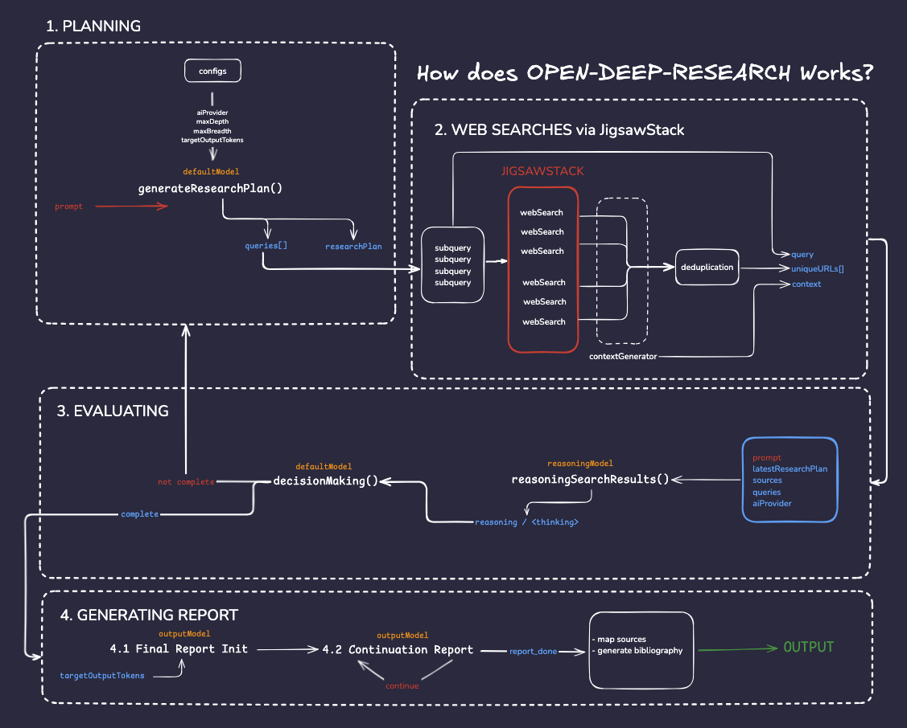

# Open Deep Research

Open Deep Research is an open source library for conducting deep, multi-hop research with reasoning capabilities. It performs focused web searches with recursive exploration to provide comprehensive, evidence-backed answers to complex questions.




## 🧱 Core Concepts

| Concept           | Description                                                                                                          |
| ----------------- | -------------------------------------------------------------------------------------------------------------------- |
| **Deep Thinking** | The system breaks down a question into logical parts, reasons through them independently, and synthesizes an answer. |
| **Deep Research** | The system performs multi-hop, focused web searches, compares the findings, and composes an evidence-backed answer.  |

## 🚀 Installation

```bash
npm install open-deep-research
```

## 🚀 Quick Start 

### Basic Usage
```typescript
import { createDeepResearch } from "open-deep-research";

// Create instance using the factory function with default settings
const deepResearch = createDeepResearch({
  OPENAI_API_KEY: process.env.OPENAI_API_KEY,
  GEMINI_API_KEY: process.env.GEMINI_API_KEY,
  DEEPINFRA_API_KEY: process.env.DEEPINFRA_API_KEY,
  JIGSAW_API_KEY: process.env.JIGSAW_API_KEY,
});

// Research prompt
const prompt = "What are the recent developments in quantum computing?";

// Generate research report
const result = await deepResearch.generate(prompt);

console.log(result.data.text);
console.log(result.data.bibliography);
```

### Advanced Usage
```typescript
import { createDeepResearch } from "open-deep-research";
import { createGoogleGenerativeAI } from "@ai-sdk/google";
import { createDeepInfra } from "@ai-sdk/deepinfra";
import { createOpenAI } from "@ai-sdk/openai";

// Initialize AI providers
const gemini = createGoogleGenerativeAI({
  apiKey: process.env.GEMINI_API_KEY,
});

const deepinfra = createDeepInfra({
  apiKey: process.env.DEEPINFRA_API_KEY,
});

const openaiProvider = createOpenAI({
  apiKey: process.env.OPENAI_API_KEY,
});

// Get model instances
const geminiModel = gemini("gemini-2.0-flash");
const deepseekModel = deepinfra("deepseek-ai/DeepSeek-R1");
const openaiModel = openaiProvider("gpt-4o");

// Create instance with custom configuration
const deepResearch = createDeepResearch({
  report: {
    maxOutputTokens: 30000,
    targetOutputTokens: 10000,
  },
  depth: {
    maxDepth: 4, // How many iterations of research to perform
  },
  breadth: {
    maxBreadth: 3, // How many subqueries to generate
  },
  models: {
    default: openaiModel,
    reasoning: deepseekModel,
    output: geminiModel,
  },
  logging: {
    enabled: true, // Enable console logging
  },
  OPENAI_API_KEY: process.env.OPENAI_API_KEY,
  GEMINI_API_KEY: process.env.GEMINI_API_KEY,
  DEEPINFRA_API_KEY: process.env.DEEPINFRA_API_KEY,
  JIGSAW_API_KEY: process.env.JIGSAW_API_KEY,
});

// Research prompt
const prompt = "What are the recent developments in quantum computing?";

// Generate research report
const result = await deepResearch.generate(prompt);

console.log(result.data.text);
console.log(result.data.bibliography);
```

## 🧩 How It Works
1️⃣ **Research Planning & Analysis**
- Creates a DeepResearch instance with user-provided configuration
- Analyzes the input prompt to understand requirements
- Generates a comprehensive research plan
- Breaks down into focused sub-queries using LLMs

2️⃣ **Data Collection & Processing** 
- Executes AI-powered web searches for each sub-query via JigsawStack API
- Gathers and validates relevant sources
- Generates context from search results
- Deduplicates URLs to ensure unique sources

3️⃣ **Analysis & Synthesis**
- Processes gathered information through reasoning models
- Analyzes and synthesizes the findings
- Evaluates information sufficiency
- Determines if additional research is needed
- Performs iterative research within configured depth limits if needed

4️⃣ **Report Generation & Citations**
- Creates comprehensive final report
- Iteratively generates content until complete
- Maps sources to reference numbers
- Generates bibliography with citations
- Formats output according to target length requirements


## 🛠️ Contributing
Contributions are welcome! Please feel free to submit a PR :)

