# Open Deep Research

An OpenSource Deep Research library with reasoning capabilities, inspired by ChatGPT's deep research feature. This library enables multi-hop, focused web searches with recursive exploration to provide comprehensive, evidence-backed answers to complex questions.

## 🧱 Core Concepts

| Concept           | Description                                                                                                          |
| ----------------- | -------------------------------------------------------------------------------------------------------------------- |
| **Deep Thinking** | The system breaks down a question into logical parts, reasons through them independently, and synthesizes an answer. |
| **Deep Research** | The system performs multi-hop, focused web searches, compares the findings, and composes an evidence-backed answer.  |

## 🚀 Installation

```bash
npm install open-deep-research
```

## 📝 Usage

```typescript
import { createDeepResearch } from 'open-deep-research';

// Create a deep research instance
const research = await createDeepResearch({
  prompt: ['What are the latest advancements in quantum computing?'],
  depth: {
    level: 3, // How deep to go with recursive searches
  },
  breadth: {
    maxParallelTopics: 4, // How many sub-questions to explore
  },
});

// More implementation examples coming soon...
```

## 🧩 How It Works

```mermaid
graph

A[User Question] --> B[🔍 Analyze Intent & Context]
B --> C[🧩 Break into Sub-questions]
C --> D[🌐 Targeted Search for Each Sub-question]
D --> E[📚 Retrieve Relevant Sources]
E --> F[🧠 Summarize & Extract Key Points]
F --> G[⚖️ Compare & Evaluate Answers]
G --> H[🧠 Synthesize Final Answer]
H --> I[📝 Output Answer + Citations + Follow-ups]
```



## 🔬 Technical Implementation

The deep research process works as follows:

1. **Query Analysis**: The main query is analyzed to understand its intent and scope.
2. **Subquery Decomposition**: The main query is broken down into focused sub-questions using LLMs.
3. **Web Search Execution**: Each sub-question triggers a web search using the JigsawStack API.
4. **Content Processing**: Search results are cleaned, summarized, and key information is extracted.
5. **Recursive Exploration**: Based on the initial findings, new sub-questions may be generated.
6. **Depth Control**: The recursion continues until the configured maximum depth is reached.
7. **Synthesis**: All gathered information is synthesized into a comprehensive answer.
8. **Citation**: Claims are linked to their source material with proper citations.

## 📏 Recursion Control

The system implements the following controls to manage recursive sub-searches:

| Control               | Purpose                         | Implementation                                       |
| --------------------- | ------------------------------- | ---------------------------------------------------- |
| **Max Depth**         | Prevent infinite recursion      | Tracking a depth variable (0=main, 1=sub, 2=sub-sub) |
| **Relevance Check**   | Keep sub-queries on topic       | Using LLM to verify relevance to the main question   |
| **Context Retention** | Maintain focus on main question | Including main question context in all sub-searches  |
| **Deduplication**     | Avoid redundant searches        | Tracking previously searched queries                 |

## 📚 Architecture

The library is built with a modular architecture:

- **Generators**: Create sub-questions from the main prompt
- **Providers**: Interface with different LLM and search APIs
- **Preparation**: Clean and process web content
- **Synthesis**: Combine multiple sources into coherent answers

## 🔧 Configuration Options

| Option                      | Description                                     | Default        |
| --------------------------- | ----------------------------------------------- | -------------- |
| `depth.level`               | Recursion depth (1-5)                           | 3              |
| `breadth.maxParallelTopics` | Number of sub-questions to explore              | 3              |
| `breadth.minRelevanceScore` | Minimum relevance score (0-1) for sub-questions | 0.7            |
| `models.default`            | Default LLM for general tasks                   | gpt-4.1        |
| `models.quick`              | Faster LLM for simpler tasks                    | gemini-2-flash |
| `models.reasoning`          | LLM optimized for complex reasoning             | deepseek-r1    |

## 🛠️ Implementation Guide (For Contributors)

To implement the deep research functionality:

1. **Set up the recursion system**:

   - Implement a depth tracker that counts recursion levels
   - Create a context chain that passes information between recursion levels
   - Implement logic to stop at max depth

2. **Enhance the sub-question generation**:

   - Make sub-questions aware of previous search results
   - Implement relevance scoring against the main question
   - Filter out irrelevant or redundant questions

3. **Implement result aggregation**:

   - Create a system to merge findings from different search paths
   - Resolve contradictions between sources
   - Weight information by source credibility and relevance

4. **Add citation tracking**:
   - Track the source of each piece of information
   - Generate properly formatted citations
   - Link assertions in the final answer to specific sources

## 📄 License
Will have to add something here. (TODO)
