# Open Deep Research

An OpenSource Deep Research library with reasoning capabilities, inspired by ChatGPT's deep research feature. This library enables multi-hop, focused web searches with recursive exploration to provide comprehensive, evidence-backed answers to complex questions.

## 🧱 Core Concepts

| Concept           | Description                                                                                                          |
| ----------------- | -------------------------------------------------------------------------------------------------------------------- |
| **Deep Thinking** | The system breaks down a question into logical parts, reasons through them independently, and synthesizes an answer. |
| **Deep Research** | The system performs multi-hop, focused web searches, compares the findings, and composes an evidence-backed answer.  |

## 🚀 Installation

```bash
npm install open-deep-research
```

## 📝 Usage

```typescript
import { createDeepResearch } from 'open-deep-research';

// Simplest usage with a single API key
const research = await createDeepResearch({
  prompt: ['What are the latest advancements in quantum computing?'],
  apiKey: 'your-deepseek-api-key', // Single API key for default model
  model: 'deepseek-r1', // Specify single model directly
  depth: { level: 3 },
  breadth: { maxParallelTopics: 4 },
});

// OR advanced usage with multiple models
const research = await createDeepResearch({
  prompt: ['What are the latest advancements in quantum computing?'],
  apiKeys: {
    deepseek: 'your-deepseek-api-key',
    openai: 'your-openai-api-key',
    gemini: 'your-gemini-api-key',
  },
  models: {
    subQuestionGeneration: 'gemini-1.5-flash',
    webSearchAnalysis: 'deepseek-r1',
    finalSynthesis: 'gpt-4o',
  },
  depth: { level: 3 },
  breadth: { maxParallelTopics: 4 },
});

// Get the research results
const results = await research.execute();
console.log(results.answer);

```

## 🧩 How It Works

```mermaid
graph

A[User Question] --> B[🔍 Analyze Intent & Context]
B --> C[🧩 Break into Sub-questions]
C --> D[🌐 Targeted Search for Each Sub-question]
D --> E[📚 Retrieve Relevant Sources]
E --> F[🧠 Summarize & Extract Key Points]
F --> G[⚖️ Compare & Evaluate Answers]
G --> H[🧠 Synthesize Final Answer]
H --> I[📝 Output Answer + Citations + Follow-ups]
```



## 🔬 Technical Implementation

The deep research process works as follows:

1. **Query Analysis**: The main query is analyzed to understand its intent and scope.
2. **Subquery Decomposition**: The main query is broken down into focused sub-questions using LLMs.
3. **Web Search Execution**: Each sub-question triggers a web search using the JigsawStack API.
4. **Content Processing**: Search results are cleaned, summarized, and key information is extracted.
5. **Recursive Exploration**: Based on the initial findings, new sub-questions may be generated.
6. **Depth Control**: The recursion continues until the configured maximum depth is reached.
7. **Synthesis**: All gathered information is synthesized into a comprehensive answer.
8. **Citation**: Claims are linked to their source material with proper citations.

## 📏 Recursion and Context Management

The system implements the following controls to manage recursive sub-searches and memory:

| Control                | Purpose                                | Implementation                                                  |
| ---------------------- | -------------------------------------- | --------------------------------------------------------------- |
| **Max Depth**          | Prevent infinite recursion             | Tracking a depth variable (0=main, 1=sub, 2=sub-sub)            |
| **Relevance Check**    | Keep sub-queries on topic              | Using LLM to verify relevance to the main question              |
| **Context Retention**  | Maintain focus on main question        | Including main question context in all sub-searches             |
| **Deduplication**      | Avoid redundant searches               | Tracking previously searched queries                            |
| **Token Management**   | Prevent context bloat                  | Tracking token usage and applying pruning strategies            |
| **Context Hierarchy**  | Organize research data                 | Storing research context in a tree structure that mirrors depth |
| **Memory Pruning**     | Manage memory constraints              | Automatically remove least relevant information when needed     |
| **Persistent Context** | Save context for long-running research | Option to save context to disk for later resumption (optional)  |

## 📚 Architecture

The library is built with a modular architecture:

- **Generators**: Create sub-questions from the main prompt
- **Providers**: Interface with different LLM and search APIs
- **Preparation**: Clean and process web content
- **Synthesis**: Combine multiple sources into coherent answers
- **Memory**: Manage context and token usage throughout the research process
- **Reasoning**: Handle multi-step thinking and decision-making

## 🔧 Configuration Options

| Option                            | Description                                     | Default          |
| --------------------------------- | ----------------------------------------------- | ---------------- |
| `depth.level`                     | Recursion depth (1-5)                           | 3                |
| `breadth.maxParallelTopics`       | Number of sub-questions to explore              | 3                |
| `breadth.minRelevanceScore`       | Minimum relevance score (0-1) for sub-questions | 0.7              |
| `models.default`                  | Default LLM for general tasks                   | gpt-4.1          |
| `models.quick`                    | Faster LLM for simpler tasks                    | gemini-2-flash   |
| `models.reasoning`                | LLM optimized for complex reasoning             | deepseek-r1      |
| `memory.maxContextTokens`         | Maximum tokens to store in context              | 16000            |
| `memory.pruningStrategy`          | How to manage context when limit reached        | 'least-relevant' |
| `memory.persistToFile`            | Save context to disk for later use              | false            |
| `response.maxTokens`              | Maximum tokens in the final response            | 4000             |
| `response.includeThinkingProcess` | Show reasoning steps in the output              | false            |
| `response.streamResults`          | Stream intermediate results during research     | false            |

## 🧠 Reasoning Process

The library uses DeepSeek R1 with thinking capabilities to provide transparent reasoning:

1. **Initial Analysis**: Break down complex questions and identify key components
2. **Step-by-Step Reasoning**: Show the thought process for evaluating information
3. **Source Evaluation**: Analyze the credibility and relevance of different sources
4. **Conflict Resolution**: Identify and resolve contradictions between sources
5. **Conclusion Formation**: Show the reasoning path to the final answer

**Example thinking process output:**

1. The question asks about quantum computing advancements.
2. From source A, we know about quantum supremacy demonstrations.
3. Source B mentions error correction improvements.
4. Source C discusses topological qubits.
5. Sources A and B are academic papers while C is a news article.
6. The academic sources provide more technical depth, suggesting...
7. Therefore, the most significant recent advancements appear to be...

## 🛠️ Implementation Guide (For Contributors)

To implement the deep research functionality:

1. **Set up the recursion system**:

   - Implement a depth tracker that counts recursion levels
   - Create a context chain that passes information between recursion levels
   - Implement logic to stop at max depth

2. **Enhance the sub-question generation**:

   - Make sub-questions aware of previous search results
   - Implement relevance scoring against the main question
   - Filter out irrelevant or redundant questions

3. **Implement result aggregation**:

   - Create a system to merge findings from different search paths
   - Resolve contradictions between sources
   - Weight information by source credibility and relevance

4. **Add citation tracking**:

   - Track the source of each piece of information
   - Generate properly formatted citations
   - Link assertions in the final answer to specific sources

5. **Implement memory management**:
   - Track token usage throughout the research process
   - Apply pruning strategies to manage context size
   - Implement hierarchical storage for context data

   - 1.	Keep context in memory during a single run (tree structure)
	- 2.	Persist to disk at regular intervals or per depth (for crash recovery + debugging)
	- 3.	Pass context around functions to keep it functional and testable

## 📄 License

Will have to add something here. (TODO)
